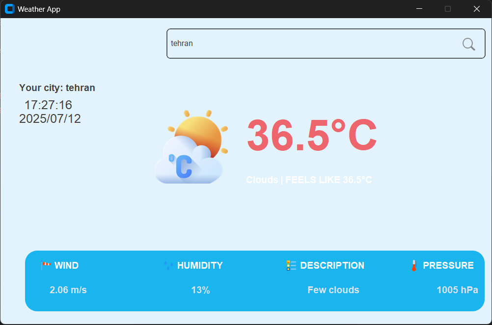

# ☀️ Weather App with Python

Welcome to my weather app! This is a simple and attractive application built with Python that displays the weather information of any city you like. It uses the **OpenWeatherMap API** to fetch data and has a UI built with **customtkinter** which is both sleek and user-friendly! 🌍

##

##

## ✨ Features

This app has some cool features that make using it enjoyable:

- 🌡️ **Display Weather Information**: View temperature (in Celsius), humidity, wind speed, and air pressure.
- ⏰ **Local City Time**: Shows the local time and date of the city based on its exact timezone.
- 🎨 **Beautiful UI**: Minimal and attractive design with pleasant colors and cute icons.
- 🚨 **Error Handling**: If something is wrong (like the city name or internet), a clear and user-friendly error message is shown.
- 🏗️ **Clean Architecture**: Refactored into a professional package with a layered architecture (API, Core, Infra, Models).

---

## 🛠️ Installation & Setup

To run the app, just follow these simple steps:

1. **Install Python** 🐍\
   If you haven't installed Python, download and install version 3.x from the [official Python website](https://www.python.org/downloads/).

2. **Install the Package** 📦\
   Run this command in the project root to install the application and its dependencies:

   ```bash
   pip install .
   ```

3. **Get API Key from OpenWeatherMap** 🔑

   - Go to [OpenWeatherMap](https://openweathermap.org/) and create a free account.
   - After signing up, you'll receive an **API Key**. Add it to the `src/weather_app/main.py` file:
     ```python
     api_key = "Your API Key"  # Replace this with your own key!
     ```

4. **Run the App** 🚀\
   Use this command to run the program:

   ```bash
   weather-app
   ```
   or
   ```bash
   python -m weather_app.main
   ```

---

## 📖 How to Use

Using the app is super easy:

1. Open the app.
2. Enter the name of the city in the input field (e.g., `Tehran` or `London`).
3. Click the search button (🔍).
4. View the weather info, local time, and other details!

---

## 🏗️ Project Structure

The project has been refactored into a professional Python package:

- `src/weather_app/api/`: GUI implementation and Facade interface.
- `src/weather_app/core/`: Business logic and coordination.
- `src/weather_app/infra/`: Infrastructure services for external APIs (Weather, Geolocation).
- `src/weather_app/models/`: Data models (Dataclasses) for weather and location.
- `src/weather_app/assets/`: Icons and images.
- `tests/`: Pytest unit tests.

---

## 🌐 About the API

This app uses the [**OpenWeatherMap API**](https://openweathermap.org/api), one of the best and most popular weather data services. It provides accurate and up-to-date data from around the world.

---

## 📬 Contact Me

If you have questions, suggestions, or want to collaborate, I’d love to hear from you:

- **Email**: [Arshia82sbn@gmail.com](mailto:Arshia82sbn@gmail.com)
